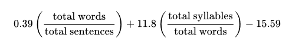
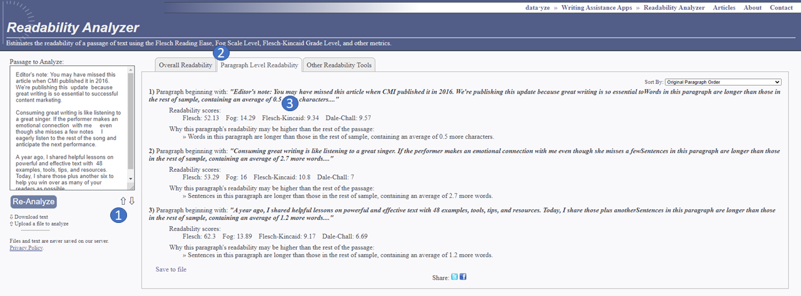
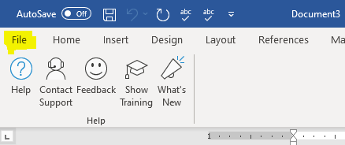
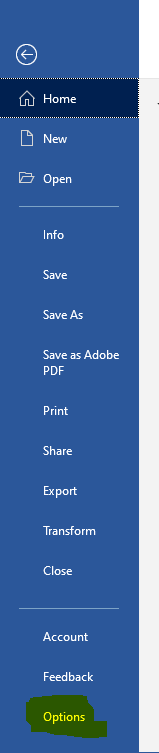
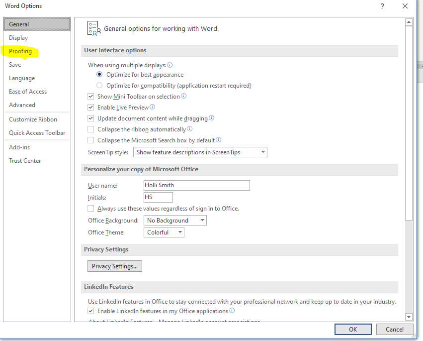
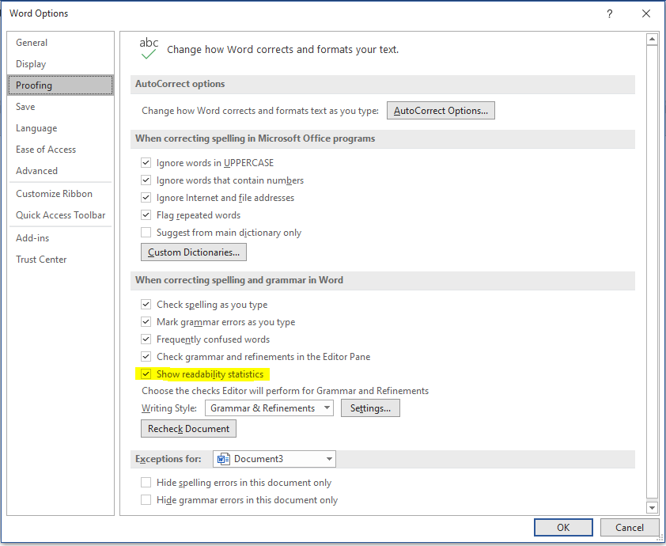
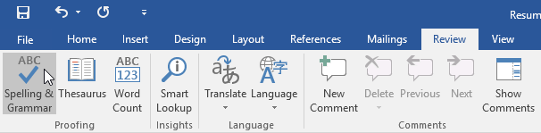
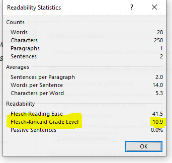

The "Flesch–Kincaid Grade Level Formula" presents a score as a U.S. grade level, making it to judge the readability level of various books and texts written in English. It can also mean the number of years of education generally required to understand this text, relevant when the formula results in a number greater than 10. The grade level is calculated with the following formula:

## Tips for Testing
1. Test content as it is meant to be read. For web content, this may mean you want to test individual sections of a page. The context of the content can affect the score so it's not a good idea to test large sections of text at one time.
2. There are some times where you may need to make substitutions for testing content. Numbers, names, addresses, and technical terms can all artificially raise the testing score. Since these things can not be replaced it's good to make a substitution for example you might replace "Call (123)123-1234" with "Call phone number" in order to get a 1more accurate score.
3. Flesch-Kincaid relies on sentence length which means you must have punctuation for web content if you have a heading or bulleted list without punctuation you may need to add periods or semicolons to the end of each statement for the purposes of testing.
4. Content should be written at a 6th-grade reading level meaning that the flesch-kincaid grade level score should be equal to or less than 6.9. We chose this grade level because this level is typically considered easy to understand and conversational.
5. Different tools may have slightly different readability scores however they should be close enough to each other to fall within the same grade level which is why the measurement we are using for measurement is grade level instead of readability score.

## Testing With Readability Analyzer
[Readability analyzer ](https://datayze.com/readability-analyzer) is an online tool that you can use to test flesch-kincaid reading level.

### Steps To Use
1. Upload a document or copy and paste your content into the field. You can copy and paste everything you want to test as long as it's separated by paragraphs. Submit with the Re-Analyze button.
2. Select the tab "Paragraph-Level Readability"
3. Use the Flesch-Kincaid score as this is the grade-level rating. 

## Microsoft Word
If you have access to word, the spelling and grammar feature has a built-in Flesch-Kincaid calculator. However it is disabled by default and will need to be activated. The method for activating the calculator may vary by version. 

### Activate Flesch-Kincaid Calculator in Word
1. In Word select "File"

2. Select "Options"

3. In the word options dialog window select "Proofing"

4. In the section "When correcting grammar in word" make sure the checkbox for "Show readability statistics" is checked. Then click the OK button.

### Run Flesch-Kincaid Test in Word
Once you have the reading statistics turned on in word you can use the spelling and grammar check to test content. Test one section of content at a time this will help you get an accurate reading level and make it easy for you to identify what sections of content need to be updated. You may need to open two documents one with your content and another for testing. Test one paragraph at a time for best results, it is best if the only thing in the document is the paragraph you are testing so that the context doesn't influence the test results.
#### Test Steps
1. Paste content into fresh word document.
2. In order to run a test you can use the keyboard shortcut F7 or click the spelling and grammar button typically found under the review tab.

3. A "Readability Statistics" dialog will appear. Use the Flesch-Kincaid Grade Level as the score for your content.

