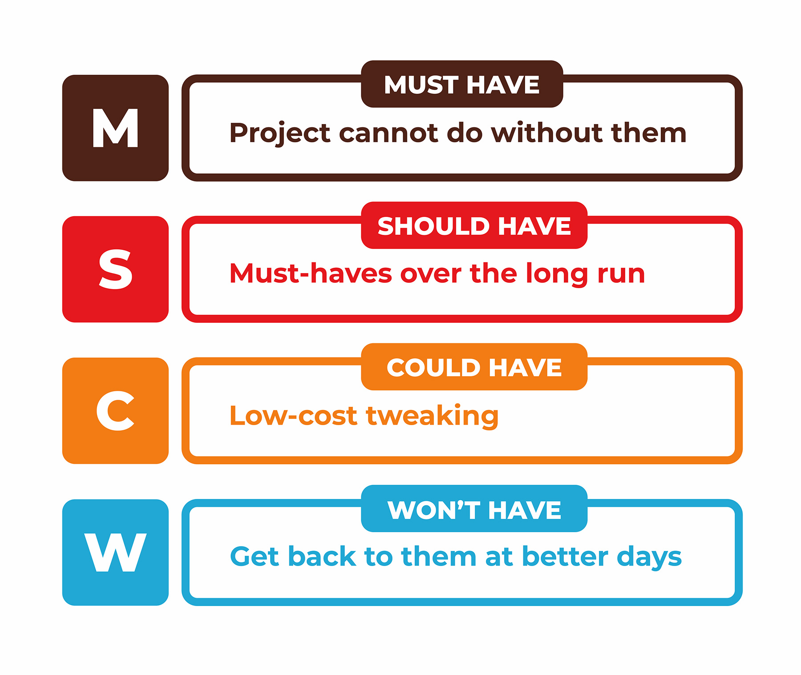

## Creating Issues:

Navigate to project> [Issues](https://code.doctorlingo.com/doctorlingo/doctorlingo.com/-/issues)> Add Title, and choose Issue (for general issue) or Design (for design issue).

For simplification please provide a detailed explanation of what should be accomplished. _Please, if able, include a picture, snapshot, or drawing of what you imagine the issue should accomplish._ Add tasks using "[]" if multiple tasks are involved. 

Include your name with @name for contact questions. 

## Prioritizing Issues:

Doctorlingo follows the [MoSCoW protocols](https://www.productplan.com/glossary/moscow-prioritization/). We have had past experience with [scope creep](https://www.productplan.com/scope-creep/)- the plan to implent one feature, or a set of features, but the list unintentionally continues to grow. Otherwise put, we are implementing this to prevent [overengineering](https://medium.com/better-programming/overengineering-why-we-do-it-and-10-ways-to-tackle-it-460663d35ff3) and killing off our project that everyone put numerous man hours towards. 

#### Must Have addresses
    - What happens if we release without this?
    - Is there a workaround or a more simple way to accomplish this?
    - Will the release/project/product work without this initiative?
	- Additionally, for our current purposes it has a **direct impact on one of three factors**:
		**Users**- Increases user engagement
		**Volunteers**- Promotes the addition of new volunteers for site for database expansion
		**Donations**- Allows for financial support to cover development and maintenance fees
		
#### Should Have addresses
- If left out, the product or project still functions. However, if they are included, they add significant value.
- performance improvements, minor bug fixes, or new functionality
	
#### Could Have ("Nice to Haves") addresses
- not necessary to the core function of the product
	
#### Will Not Have addresses
- will not be included in a specific release
- Some initiatives in the “will-not-have” group will get prioritized in the future, while others are not likely to happen at all

## Ownership

Ownership is two-fold. The issue creator and the assignee.
	- **Creator**- Periodically follow-up on your issues, especially if they are in the "Must Have" or "Should Have" priorities! Reach out directly to the assignee. If no response, please contact @joshc or @anamariaiuga for reassignment.
	- **Assignee**- If accepting an issue, please follow-thru. You are welcome to research and chat with the creator to make sure that you are well-suited and have an understanding of the task. If you find that you are having a difficult time accomplishing the task, please contact @tfreshdev for advice on how to proceed. 